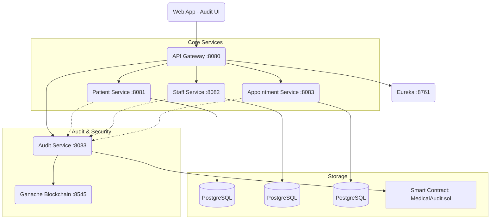

# 🏥 MedChain - Documentation Complète du Système

> **Version** : 1.1.0 - Data Integrity Update  
> **Date** : 10 Février 2026

---

## 📑 Table des Matières
1. [Introduction](#1-introduction)
2. [Architecture Technique](#2-architecture-technique)
3. [Installation & Démarrage](#3-installation--démarrage)
4. [Fonctionnalité Clé : Intégrité des Données (Data Integrity)](#4-fonctionnalité-clé--intégrité-des-données-data-integrity)
5. [Manuel Utilisateur](#5-manuel-utilisateur)
6. [Détails Techniques par Service](#6-détails-techniques-par-service)
7. [Dépannage](#7-dépannage)

---

## 1. Introduction

Ce projet est une implémentation avancée de gestion hospitalière sécurisée par Blockchain (Kit Commun - Sujet 1). Il vise à garantir l'intégrité, la traçabilité et l'auditabilité des actions critiques (création de patients, modifications de staff, rendez-vous) grâce à un registre immuable distribué.

### Objectifs Principaux
*   **Intégrité** : Chaque donnée critique est hachée (SHA-256) et ce hash est ancré sur la blockchain.
*   **Traçabilité** : Chaque action (Create, Update, Delete) génère une transaction blockchain.
*   **Audit** : Une interface dédiée permet de visualiser et vérifier les preuves cryptographiques.

---

## 2. Architecture Technique

Le système repose sur une architecture microservices orchestrée par Docker.



---

## 3. Installation & Démarrage

### Pré-requis
*   Docker & Docker Compose
*   Java 17+ (optionnel si utilisation pure Docker)
*   Node.js 18+ (pour le frontend si développement local)

### Démarrage Rapide (Tout Docker)

1.  **Cloner le projet**
    ```bash
    git clone <repository_url>
    cd hospital-management-system
    ```

2.  **Lancer l'orchestration**
    ```bash
    docker-compose up -d --build
    ```

3.  **Accéder aux interfaces**
    *   **Audit UI (Frontend)** : http://localhost:5173
    *   **API Gateway** : http://localhost:8080
    *   **Eureka Dashboard** : http://localhost:8761

### Mise à jour après modification (Rebuild sélectif)
Si vous modifiez le code, vous pouvez rebuilder uniquement les services concernés :
```bash
docker-compose up -d --no-deps --build audit-service patient-service
```

---

## 4. Fonctionnalité Clé : Intégrité des Données (Data Integrity)

Cette fonctionnalité est le cœur de la sécurité du système. Elle a été implémentée pour détecter toute modification non autorisée des données via la base de données (attaque interne ou externe).

### 4.1 Comment ça marche ?

1.  **Hashing à la source** : 
    *   À chaque création ou modification d'une entité (Patient, Staff, Appointment), le service calcule un **Hash SHA-256** de l'objet JSON complet.
    *   Ce hash est stocké dans la colonne `integrity_hash` de la base SQL locale.

2.  **Ancrage Blockchain** :
    *   Simultanément, ce hash est envoyé au Smart Contract `MedicalAudit.sol` via l'événement `AuditLogCreated`.
    *   Il devient alors **immuable** et **daté**.

3.  **Vérification** :
    *   L'interface d'Audit compare le hash stocké dans la base SQL avec celui ancré sur la Blockchain.
    *   Si les deux correspondent → **Statut VERIFIED**.
    *   Si différence → **ALERTE INTRUSION**.

### 4.2 Composants Modifiés

*   **Smart Contract** : Mise à jour de `logAction` pour accepter et émettre le `dataHash`.
*   **Services Backend** : Ajout du calcul de hash avant chaque `save()`.
*   **Audit Service** : Décodage avancé des événements Blockchain (support du nouveau format avec hash).

---

## 5. Manuel Utilisateur

### Accès
*   **URL** : `http://localhost:5173`

### Fonctionnalités

#### A. Tableau de Bord (Dashboard)
Vue d'ensemble de l'activité du système, état de la connexion blockchain, et logs récents.

#### B. Audit Trails (Piste d'Audit)
C'est ici que vous vérifiez l'intégrité des données.
*   **Colonne "DATA HASH (INTEGRITY)"** : Affiche l'empreinte cryptographique.
*   **Statut** : 
    *   🟢 **VERIFIED** : La donnée est intègre.
    *   🔴 **TAMPERED** : La donnée a été modifiée hors processus valide.

#### C. Simulations
*   **Gestion Patients** : Créez, modifiez ou supprimez des patients pour générer des preuves d'intégrité.
*   **Gestion Personnel** : Idem pour le staff médical.

---

## 6. Détails Techniques par Service

### 🔗 Blockchain Network (`blockchain-network`)
*   **Contrat** : `MedicalAudit.sol`
*   **Adresse actuelle** : `0x3525c13cBEE5aF47a2a53ec4881bFdAECD9A2878` (Mise à jour le 10/02/2026)
*   **Outil** : Ganache CLI & Truffle

### 🛡️ Audit Service (`audit-service`)
*   **Port** : 8083
*   **Rôle** : Interface entre les microservices métier et la blockchain (via Web3j).
*   **Base de Données** : H2 (interne pour cache) + Blockchain (source de vérité).

### 🏥 Services Métier (`patient`, `staff`, `appointment`)
*   **Rôle** : Gestion CRUD des entités.
*   **Particularité** : Chaque service possède un `AuditClient` (Feign) pour envoyer les logs de manière asynchrone.

---

## 7. Dépannage

**Problème : "Backend Disconnected" sur l'UI**
*   **Solution** : Vérifiez que les conteneurs sont lancés (`docker ps`). Si `audit-service` est arrêté, relancez-le.

**Problème : Hash "N/A" dans l'Audit Trail**
*   **Cause** : Le log a été créé avant la mise à jour Data Integrity (rétrocompatibilité).
*   **Solution** : Créez une nouvelle donnée pour voir le hash.

**Problème : Erreur de décodage des logs**
*   **Cause** : Incompatibilité entre l'adresse du contrat dans `docker-compose.yml` et le réseau Ganache actuel.
*   **Solution** : Vérifiez l'adresse `WEB3J_CONTRACT_ADDRESS` et redéployez si nécessaire.

---

## 8. Annexe : Matrice de Conformité (Cahier des Charges - Sujet 1)

Ce tableau synthétise la couverture des exigences fonctionnelles, techniques et critères d'acceptation définis dans le Cahier des Charges.

| Réf CDC | Exigence | Implémentation MedChain | Statut |
| :--- | :--- | :--- | :---: |
| **Atelier 1** | **Architecture Microservices** | Architecture conservée (Patient, Staff, Appointment, Gateway, Discovery). | ✅ |
| **Atelier 2 (1.1.1)** | **Blockchain Privée** | Réseau **Ganache** (Dockerisé) utilisé comme Ledger privé. | ✅ |
| **Atelier 2 (1.1.2)** | **Smart Contract** | Contrat `MedicalAudit.sol` stockant les preuves d'audit. | ✅ |
| **Atelier 2 (1.1.3)** | **RGPD & Données Sensibles** | **Aucune donnée claire** sur la blockchain (Pseudonymisation + Hash). | ✅ |
| **Atelier 2 (1.2)** | **Microservice Audit** | Service `audit-service` centralisant la communication Blockchain via Web3j. | ✅ |
| **Atelier 3 (1.1)** | **Stack Technique** | Spring Boot 3, PostgreSQL, Docker Compose, API REST, JWT. | ✅ |
| **Atelier 3 (4)** | **Sécurité** | Transactions signées (Backend Wallet), APIs sécurisées par Gateway/JWT. | ✅ |
| **Page 8** | **Critère : Redémarrage** | Persistance des données Blockchain (Volume Docker) et SQL assurée après redémarrage. | ✅ |
| **Page 8** | **Critère : Filtrage Audit** | Filtrage par Patient, Utilisateur et Date implémenté dans le Backend et l'UI. | ✅ |
| **Page 8** | **Critère : Vérifiabilité** | Toute action CRUD génère une transaction vérifiable (Preuve visuelle dans l'UI). | ✅ |
| **Sprint 3** | **Interface Web Audit** | Dashboard React complet avec visualisation des blocs et statuts d'intégrité. | ✅ |
