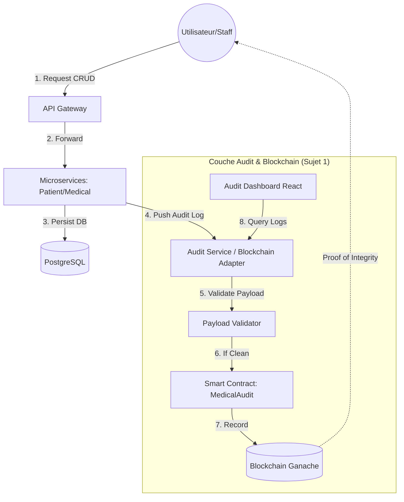

# 🏥 Rapport de Complétion - Sujet 1 : Intégrité & Traçabilité Blockchain

## 📅 Date : 10 Février 2026
**Projet** : Système de Gestion Hospitalière (Kit Commun)
**Objectif** : Assurer l'intégrité et l'auditabilité des actions critiques via Blockchain.

---

## 🏗️ 1. Architecture du Système
Le système a été étendu pour inclure une couche de confiance immuable :
- **Backend** : Microservices Spring Boot (Patient, Staff, Appointment, Medical Record).
- **Audit Service** : Service centralisateur qui reçoit les logs et les inscrit sur la blockchain.
- **Blockchain** : Réseau privé **Ganache** (Ethereum) stockant les preuves d'audit.
- **Frontend** : Dashboard d'audit en React/Vite pour visualiser et extraire les preuves.

---

## ✅ 2. État d'avancement des Exigences (Ateliers 1 à 3)

### 🛡️ Intégrité & Traçabilité (Terminé)
- **Blockchain Privée** : Déploiement réussi d'un nœud Ganache via Docker.
- **Smart Contract** : Contrat Solidity déployé pour l'enregistrement des actions (`logAction`).
- **Anonymisation (RGPD)** : 
    - Seuls les **identifiants techniques** (UUID) sont stockés. On utilise désormais des pseudonymes techniques (format UUID) au lieu de noms en clair.
    - Aucune donnée de santé (PII) n'est envoyée à la blockchain.
    - **Validation Automatique** : Le service d'audit intègre un validateur qui rejette toute transaction contenant des emails, des noms avec espaces ou des mots-clés médicaux (cancer, diabète, etc.) avant qu'elles n'atteignent le Ledger.
    - Utilisation de **Data Hashes** pour vérifier l'intégrité sans divulguer le contenu.

### ⚙️ Microservices & Backend (Terminé)
- **Intégration Patient** : Chaque action CRUD sur un patient génère une transaction.
- **Intégration Dossier Médical** : Support ajouté pour les actions sur les dossiers médicaux (`CREATE`, `VIEW`, `UPDATE`).
- **Audit Service** : Fournit une API REST pour interroger l'historique de la blockchain.

### 🖥️ Frontend & Audit UI (Terminé - 100%)
- **Tableau des Logs** : Visualisation en temps réel des blocs.
- **Détails de Transaction** : Une vue détaillée permet d'inspecter chaque hash de transaction et le hash de données.
- **Filtres Avancés** : Filtrage multidimensionnel par **Utilisateur**, **Période** et **Recherche Textuelle** (respectant les exigences de l'Atelier 3.3).
- **Statut Réseau** : Indicateur de connexion au backend.
- **Exportation** : 
    - **JSON Proof** : Preuve cryptographique complète.
    - **PDF Report** : Rapport lisible avec toutes les transactions auditées.

---

## 🛠️ 3. Guide de Test de l'Auditabilité

Pour vérifier que tout fonctionne, utilisez les scripts fournis :

1. **Test Complet (Patient)** :
   ```powershell
   powershell -ExecutionPolicy Bypass -File .\test_audit_full.ps1
   ```
   Ce script crée, modifie et supprime un patient, puis vérifie que les 3 preuves sont bien dans la blockchain.

2. **Visualisation** :
   Accédez à [http://localhost:5173](http://localhost:5173) pour voir les transactions apparaître.

---

## 📐 4. Schéma d'Architecture Final (Atelier 3)

Ce diagramme illustre le flux complet d'une action, de l'appel API jusqu'à l'ancrage blockchain.



## 📦 5. Commandes de maintenance
- **Relancer tout** : `docker-compose up -d --build`
- **Vérifier les logs blockchain** : `docker logs ganache-blockchain`
- **Vérifier les transactions d'audit** : `docker logs audit-service`

---
*Ce document sert de base pour la documentation finale du projet Sujet 1.*
